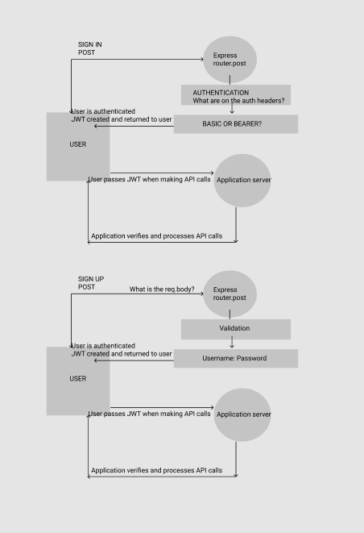

# Authentication-Server

## Author: Riva Davidowski

**An Express/Node.js based server using a custom “authentication” module that is designed to handle user registration and sign in using Basic, Bearer, or OAuth along with a custom “authorization” module**


#### Phase 1:

- Deploy an Express server that implements Basic Authentication, with signup and signin capabilities, using a Mongo database for storage.
  
#### Phase 2: 

- Any user with a valid token (from either Basic Authentication ) is able to use that token to login to the system and potentially access protected routes

#### Phase 3: 

- Implementation of OAuth(user authenticates through a 3rd party). When a “good” login happens, the user is considered to be “authenticated” and our auth-server generates a JWT signed “Token” which is returned to the application

#### Phase 4:

- Implementation of Role Based Access Control. This phase requires the use of an Access Control List (ACL), allowing to not only restrict access to routes for valid users, but also based on the individual permissions we give each user.


### Installing

**Authentication-Server:**

**You will need to install the following on your machine:**

    - `npm init -y `
    - **The entry point for this app is: `index.js`**
    - `npm install` for the following:
        - `bcrypt`
        - base-64 for decoding headers: `npm i base-64`
        - `dotenv`
        - `cors`
        - jsonwebtoken to create a coded token: `npm i jsonwebtoken`
        -  `express`

- Start server:

```
    /* give it a port number and optionally pass a function to call when app
     starts listening on given port*/

const port = process.env.PORT || 3000;
app.listen(port, () => console.log(`Listening on port ${port}`));

```

- Install MongoDB: `npm install mongodb`
- Install mongoose: `npm install -save--dev mongoose`
- Visit [docs.mongodb.com](https://docs.mongodb.com/manual/tutorial/getting-started/) to learn How to get started using MongoDB.
- Connect to your db:

```
//Connect to Database
mongoose.connect(process.env.MONGODB_URI,{useNewUrlParser:true, useUnifiedTopology: true})
    .then(() => console.log('Connected to MongoDB...'))
    .catch(err => console.error('Could not connect to MongoDB...',err));

```
### env Requirements:

PORT=3001
MONGODB_URI=(add db URI here)
SALT=(add salt level here)
JWT_SECRET=(add your secret string here)
CLIENT_ID=
CLIENT_SECRET=
REDIRECT_URI=http://localhost:3001/oauth
TOKEN_SERVER_URL=


**Testing:**

- npm i `@code-fellows/supergoose`
- npm i `jest`


### Using Authentication-Sever:

### UML:



